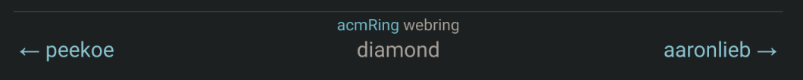

# libwebring

A tiny JavaScript library for adding a webring to your website.

<div align="center">
  
</div>

## Features

- Vanilla JS with Web Components
- No backend needed, just a simple raw GitHub link
- Periodic health checking using GitHub Actions

### Goals

- Planned JS frameworks support
  - Svelte
- Be cute
- Look cute
- Low maintenance

## Usage

Add the script tag to your place. You may choose to use something like [jsdelivr](https://jsdelivr.com/) for this:

```html
<script
  src="https://cdn.jsdelivr.net/gh/diamondburned/libwebring@nightly/dist/webring.js"
  type="module"
></script>
<link
  rel="stylesheet"
  href="https://cdn.jsdelivr.net/gh/diamondburned/libwebring@nightly/dist/webring.css"
/>
```

**Note**: `type="module"` is required. `webring.js` is a module. Consequently, it might not work on older browsers.

**Note**: It's generally a good idea to use a specific version instead of `nightly`. For now, there might not yet be a stable version, so you can use `nightly` instead.

Then, add the `<webring-element>` tag:

```html
<webring-element src="/path/to/webring.json" />
```

Make sure that your webring JSON either has the top-most domain name of your current page. For example, if you're on `b.libdb.so`, then `libdb.so` has to be on the list. Otherwise, use the `name` attribute:

```html
<webring-element name="diamond" src="/path/to/webring.json" />
```

### Example

To run the example, run

```sh
deno task serve
```

Then head to http://localhost:4507/example/.

## Customizing

If `<webring-element>` is used without any children, it will generate a default HTML template to be used as the body. If it has existing children elements, then they will be kept.

libwebring will look for the following classes to fill in the data:

- `.ring` for the name of the webring (assumed to be an `<a>` tag)
- `.left` for the left link (assumed to be an `<a>` tag)
- `.middle` for the name of the current link
- `.right` for the right link (assumed to be an `<a>` tag)

To exclude websites that don't show the same webring, you can use the `exclude-missing-webring-sites` attribute:

```html
<webring-element
  name="diamond"
  src="/path/to/webring.json"
  exclude-missing-webring-sites
/>
```

By default, libwebring will assume that there is also a status JSON file next to the webring source JSON file. For example, if the webring source file is `webring`, then `webring.status.json` will also be checked.

You can override the status source path by using the `status-src` attribute:

```html
<webring-element
  name="diamond"
  src="/path/to/webring.json"
  status-src="/path/to/webring.status.json"
/>
```

### Working without JavaScript

libwebring can act as an enhancement for when there is JavaScript with a proper HTML fallback if there isn't. You do lose some of the convenience, but it will still work. To make it work without JavaScript, simply do what you would when customizing libwebring:

```html
<webring-element name="diamond" src="/path/to/webring.json">
  <p>
    <a class="left" href="://peekoe.net" target="_blank">peekoe</a>
    <span class="middle">diamond</span>
    <a class="right" href="://lieber.men" target="_blank">aaronlieb</a>
  </p>
</webring-element>
```

Without JavaScript, the browser will simply ignore the `<webring-element>` tag and render the fallback. With JavaScript, libwebring will kick in and reuse the existing elements to fill in the latest data.
